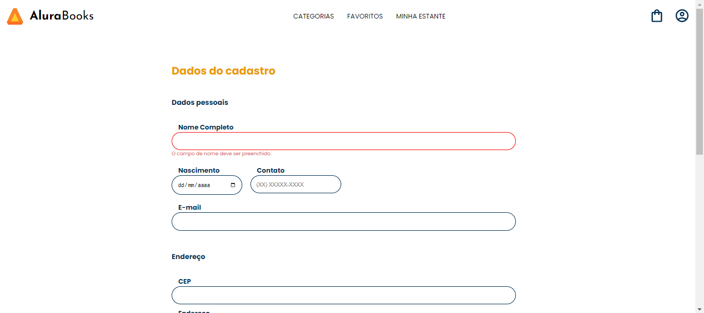

# Angular: formulários orientados a templates

Neste projeto foi desenvolvido um formulário orientado a template utilizando o FrameWwork Angular, neste curso aprendi a como utilizar o FormsModule e suas diretivas, fazer validação de campos e executar validação assíncrona com uma API. 
Esse projeto foi desenvolvido durante a o curso [Angular: formulários orientados a templates] da Alura, que faz parte da formação [Explore o Framework Angular]. 

## Tecnologias utilizas
• HTML 
• CSS 
• TypeScript 
• Angular 

### Foto do Projeto desenvolvido
